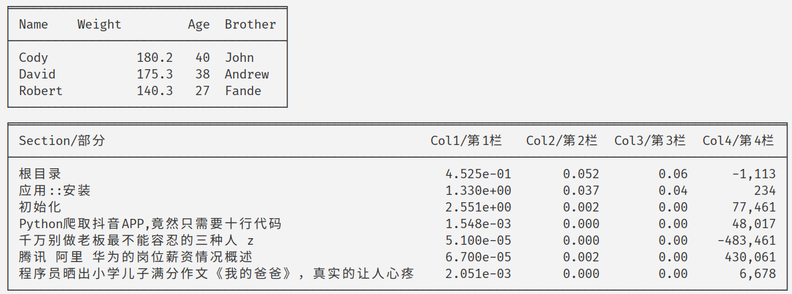

# varitab: a c++ library for pretty printing tables

Based on [this repo](https://github.com/friedmud/variadic_table), with the following changes/enhancements:

* Draw table borders using unicode characters
* Use `std::wstring` all over
* Support CJK characters
* Support `conan` package management


# Install

```
conan remote add jzien https://api.bintray.com/conan/jzien/conan
conan install varitab/0.9.2@jzien/dev -r jzien
```

# Usage

See `test_package` for an example.

You can also execute `conan test  test_package/conanfile.py varitab/0.9.2@jzien/dev` to run that test. Result would be:


